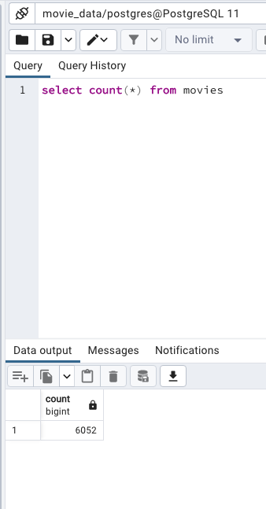
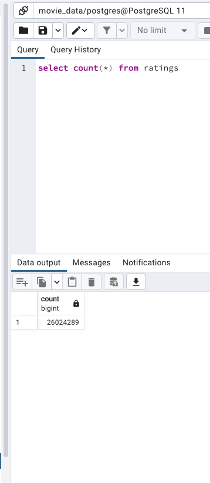

# Movies_ETL

## Overview of the Project

To provide clean data for a large-scale hackathon, multiple datasets and files have been extracted, transformed, and loaded into a PostgreSQL Database.

### Purpose

This information has been collected and cleaned to provide to all participants of the Amazing Prime hackathon to develop an algorithm to evaluate and identify which low budget films being released will become popular, so that Amazing Prime can buy the streaming rights cheaper prior to the popularity and demand. 

## Results 
 
- Movies Database:

- Ratings Database:
    
